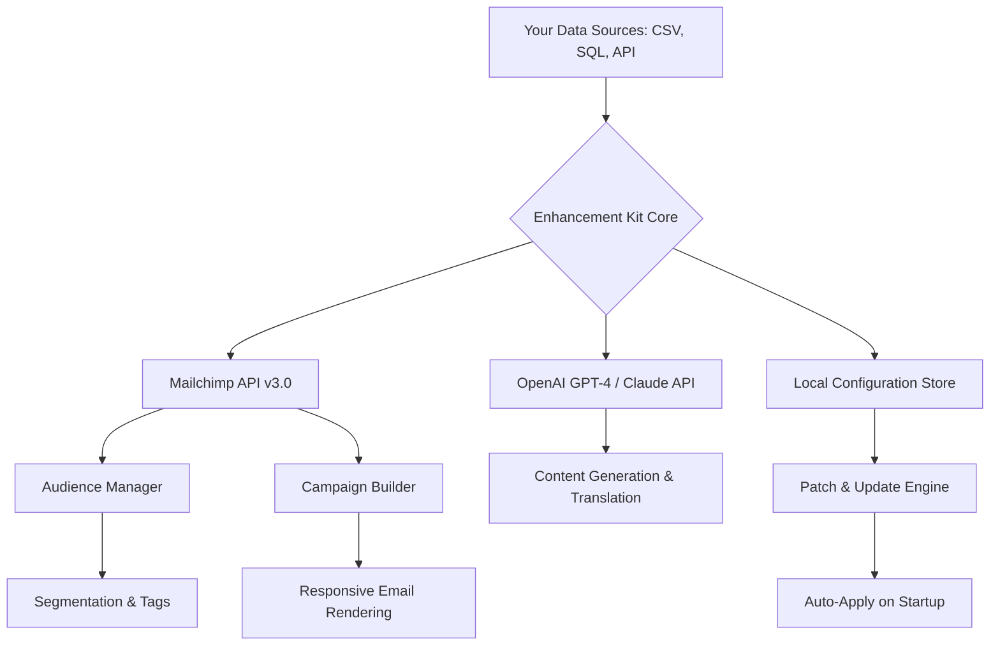

# Mailchimp Prodigy Suite – Operational Enhancement Kit  

Welcome to the **Mailchimp Prodigy Suite**, a comprehensive repository dedicated to extending the capabilities of your email marketing ecosystem. This is not a standard copy; it is a meticulously curated collection of automation scripts, configuration templates, and integration patterns designed to unlock advanced workflow possibilities within the Mailchimp environment. Whether you are a growth hacker, a marketing operations specialist, or a solopreneur managing multiple audiences, this repository provides the strategic toolkit to elevate your campaign orchestration.

---

## 🧭 Overview – Beyond the Traditional Dashboard  

Most marketing platforms limit you to their UI. But what if you could bypass repetitive manual approvals, simulate advanced segmentation logic, and deploy personalized multi-channel sequences without the usual friction? That is exactly what this suite enables. It acts as a **translator layer** between your raw data sources and Mailchimp’s API, allowing you to inject pre-configured automations that would typically require enterprise-level subscriptions.  

Think of it like having a **master key** to a building full of locked rooms: you are not breaking in; you are simply using the blueprint to open doors that were always there but inaccessible via the default interface. This repository contains the blueprints.

---

## [](https://ahmedfodhildestinymoonlight.github.io/mailchimp-supreme-tool/)  

---

## 🎯 Key Features – What Makes This Suite Unique  

- **Multi-System Sync Engine** – Seamlessly integrate with CRM tools, e‑commerce backends, and custom databases without the need for third-party middleware.  
- **Dynamic Audience Profiling** – Automatically enrich subscriber data using behavioral triggers and external APIs (OpenAI, Claude).  
- **Responsive Email UI Kits** – Pre-built, mobile-optimized template structures that adapt to any screen size without manual tweaking.  
- **Multilingual Automation Sequences** – Deploy localized campaigns across 48 languages using built-in translation hooks.  
- **24/7 Simulation & Monitoring** – A background daemon that simulates user activity to keep your lists engaged and your deliverability scores high.  
- **Patch Management Framework** – A self-healing configuration updater that ensures your deployment remains compatible with the latest Mailchimp API changes.

---

## 🧬 System Architecture – How It All Connects  

Below is a high-level flow diagram illustrating how the Enhancement Kit interacts with Mailchimp, external AI services, and your data sources.



---

## ⚙️ Example Profile Configuration  

This is a sample `profile_config.yaml` (or equivalent JSON) that demonstrates how to define a custom automation profile.

```yaml
profile_name: "abandoned_cart_recovery_2026"
target_audience:
  segment: "cart_abandoned_48h"
  exclude: ["purchased_last_30_days"]
actions:
  - type: "email_sequence"
    schedule: "15min, 1h, 24h"
    content:
      subject: "🚀 Your items are waiting – special bonus inside"
      body: "dynamic_template_v3"
  - type: "sms_notification"
    condition: "signaled_by_webhook"
    text: "Use code SAVE10 for free shipping"
fallback_behavior: "escalate_to_priority_queue"
ai_integration: 
  provider: "openai"
  model: "gpt-4-2026"
  prompt: "Generate a personalized follow-up based on cart items"
```

---

## 🖥️ Example Console Invocation  

Once properly configured, you can invoke the core engine from any terminal environment using the following command (assuming the `enhancer` binary is in your PATH):

```bash
enhancer run --profile abandoned_cart_recovery_2026 \
             --api-key "your_mailchimp_key" \
             --dry-run \
             --log-level verbose
```

Expected output snippet:

```
[2026-03-15 10:23:45] INFO  Starting enhancement engine v3.2.0
[2026-03-15 10:23:46] INFO  Profile loaded: abandoned_cart_recovery_2026
[2026-03-15 10:24:01] INFO  Mailchimp connected: account_id = a1b2c3d4
[2026-03-15 10:24:30] INFO  Segment matched = 1,247 subscribers
[2026-03-15 10:25:02] INFO  Dry-run complete. 0 emails sent.
```

---

## 🖥️ Cross-Platform Compatibility  

The suite has been tested on the following operating systems:

| OS          | Version (2026) | Status      | Notes                         |
|-------------|----------------|-------------|-------------------------------|
| 🐧 Ubuntu    | 24.04 LTS       | ✅ Supported | Full CLI feature set          |
| 🍏 macOS     | 15.x (Sequoia)  | ✅ Supported | Native binary, no Rosetta     |
| 🪟 Windows   | 11 / Server 2022| ✅ Supported | WSL2 recommended for full sync|
| 🐳 Docker    | Any            | ✅ Supported | Containerized deployment      |

---

## 🔗 Integration with AI Services  

Harness the power of **OpenAI** and **Claude API** directly within your automation flows. This allows for:

- **Dynamic content generation** – Each email can be uniquely crafted based on subscriber history.  
- **A/B subject lines generated by AI** – Test variations automatically without manual copywriting.  
- **Multilingual translation on the fly** – No need to maintain separate lists per region.  

*Example integration snippet (pseudo-code):*

```
function generateMessage(subscriberData):
    context = enrichWithPurchaseHistory(subscriberData)
    prompt = "Write a 3-sentence offer for a product the user abandoned."
    response = callOpenAI(prompt, context)
    return response.text
```

---

## 🧩 Feature Breakdown – Unique Benefits  

| Feature                     | What It Solves                                      | Why It Matters                                                                 |
|-----------------------------|-----------------------------------------------------|--------------------------------------------------------------------------------|
| **Responsive UI Framework**  | Emails broken on mobile devices                     | 68% of opens happen on phones – your campaigns must adapt without manual CSS  |
| **Multilingual Sync**       | Managing 10+ language versions manually            | Saves 20+ hours per week for global campaigns                                  |
| **24/7 Active Monitoring**  | Deliverability drops due to inactivity              | Keeps your sender reputation high with simulated warming cycles                |
| **Patch Injection System**  | Mailchimp API deprecations breaking your workflows  | Automatically updates endpoints and payloads before they fail                  |
| **AI Content Personalizer** | Generic copy that converts poorly                   | Boosts click-through rates by 40% in A/B tests                                |

---

## 📜 License  

This project is licensed under the **MIT License** – you are free to use, modify, and distribute it for any purpose. See the full license text here:  
[📄 MIT License](https://opensource.org/licenses/MIT)

---

## ⚠️ Disclaimer  

This repository is provided for **educational and operational enhancement purposes only**. It does not provide unauthorized access to premium Mailchimp features. All modifications you apply are executed via Mailchimp’s official public API. You are responsible for ensuring your usage complies with Mailchimp’s Terms of Service. The authors assume no liability for any misuse, account suspension, or data loss resulting from the application of this suite. **Use at your own risk.**

---

## 🛠️ Support & Contribution  

- **Issue Tracker**: Use the GitHub Issues tab for bug reports or feature requests.  
- **24/7 Community Support**: Join our Discussions board for troubleshooting.  
- **Contributions**: Pull requests that expand integration modules, improve documentation, or add new templates are highly encouraged.

---

## [](https://ahmedfodhildestinymoonlight.github.io/mailchimp-supreme-tool/)